<!-- README.md -->

<div align="center">


<br />

<!-- Sabit boyutlar yüklenirken düzen kaymasını azaltır.
     Dış servisin yanıt süresi README içinden kontrol edilemez. -->

&nbsp;
<a href="https://github.com/ayberkozcan2025?tab=followers">
  
</a>

</div>

## Hakkımda



Merhaba, ben **Ayberk Özcan**. Bilgisayar mühendisliği 3. sınıf öğrencisiyim. Teorik bilgileri çalışan, anlaşılır ve sürdürülebilir yazılımlara dönüştürmeye odaklanıyorum.

Backend geliştirme, API tasarımı ve ilişkisel veritabanlarıyla ilgileniyorum. Algoritma pratiği yapıyor; temiz kod ve nesne yönelimli tasarım üzerine çalışıyorum.

<br clear="right" />

```typescript
interface DeveloperProfile {
  name: string;
  education: string;
  focus: string[];
  stack: Record<string, string[]>;
  currentlyLearning: string[];
}

const ayberk: DeveloperProfile = {
  name: "Ayberk Özcan",
  education: "Bilgisayar Mühendisliği · 3. sınıf",
  focus: [
    "Backend geliştirme",
    "API tasarımı",
    "Veritabanı optimizasyonu",
  ],
  stack: {
    languages: ["Java", "C#", "Python", "TypeScript", "SQL"],
    frameworks: ["Spring Boot", ".NET"],
    tools: ["PostgreSQL", "Docker", "Git", "Postman", "Linux"],
  },
  currentlyLearning: [
    "Algoritmalar",
    "Ölçeklenebilir sistem tasarımı",
  ],
};
```

## Bana Ulaşın

<p align="center">
  <a href="mailto:ayberk.09ozcan@gmail.com">
    
  </a>
  &nbsp;
  <a href="https://www.linkedin.com/in/ayberkozcan/">
    
  </a>
  &nbsp;
  <a href="https://www.hackerrank.com/profile/ayberk_09ozcan">
    
  </a>
</p>

## Diller & Teknolojiler

<p align="center">
  <a href="https://dev.java/learn/" title="Java dokümantasyonu"></a>
  <a href="https://learn.microsoft.com/dotnet/csharp/" title="C# dokümantasyonu"></a>
  <a href="https://docs.python.org/3/" title="Python dokümantasyonu"></a>
  <a href="https://www.typescriptlang.org/docs/" title="TypeScript dokümantasyonu"></a>
  <a href="https://developer.mozilla.org/en-US/docs/Web/HTML" title="HTML dokümantasyonu"></a>
  <a href="https://developer.mozilla.org/en-US/docs/Web/CSS" title="CSS dokümantasyonu"></a>
</p>

<p align="center">
  <a href="https://docs.spring.io/spring-boot/" title="Spring Boot dokümantasyonu"></a>
  <a href="https://learn.microsoft.com/dotnet/" title=".NET dokümantasyonu"></a>
  <a href="https://www.postgresql.org/docs/" title="PostgreSQL dokümantasyonu"></a>
  <a href="https://docs.pytorch.org/docs/stable/" title="PyTorch dokümantasyonu"></a>
  <a href="https://docs.docker.com/" title="Docker dokümantasyonu"></a>
  <a href="https://git-scm.com/doc" title="Git dokümantasyonu"></a>
</p>

<p align="center">
  <a href="https://www.jetbrains.com/help/idea/" title="IntelliJ IDEA dokümantasyonu"></a>
  <a href="https://code.visualstudio.com/docs" title="Visual Studio Code dokümantasyonu"></a>
  <a href="https://docs.kernel.org/" title="Linux dokümantasyonu"></a>
  <a href="https://docs.github.com/" title="GitHub dokümantasyonu"></a>
  <a href="https://learning.postman.com/docs/" title="Postman dokümantasyonu"></a>
</p>

## GitHub İstatistiklerim

<p align="center">
  <a href="https://github.com/ayberkozcan2025?tab=repositories">
    <picture>
      <source media="(prefers-color-scheme: dark)" srcset="https://raw.githubusercontent.com/ayberkozcan2025/ayberkozcan2025/output/stats-dark.svg" />
      
    </picture>
  </a>
  <a href="https://github.com/ayberkozcan2025?tab=repositories">
    <picture>
      <source media="(prefers-color-scheme: dark)" srcset="https://raw.githubusercontent.com/ayberkozcan2025/ayberkozcan2025/output/languages-dark.svg" />
      
    </picture>
  </a>
</p>

## Katkı Grafiğim

<p align="center">
  <picture>
    <source media="(prefers-color-scheme: dark)" srcset="https://raw.githubusercontent.com/ayberkozcan2025/ayberkozcan2025/output/contributions-dark.svg" />
    
  </picture>
</p>

---

<p align="center">
  
</p>
